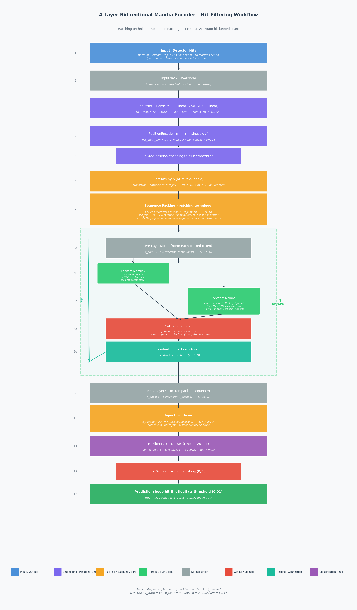

# 4-Layer Bidirectional Mamba Encoder — Hit-Filtering Workflow

This document walks through every computational step of the **BidirectionalMambaEncoder**
used for ATLAS Muon hit filtering in this repository.
The key batching technique used during training and inference is **sequence packing**:
rather than padding every event to the same length, all valid hits across the mini-batch
are concatenated into a single contiguous sequence, avoiding any wasted computation on
padding positions.

---

## Visual Overview



> **Regenerate the diagram** by running:
> ```bash
> python docs/mamba_encoder_workflow.py
> ```

---

## Step-by-Step Description

### Step 1 — Input: Detector Hits

| Property | Value |
|---|---|
| Tensor shape | `(B, N_max, 18)` |
| `B` | batch size (number of events) |
| `N_max` | maximum hits per event (padded) |
| 18 features | coordinates (globEdgeHighX/Y/Z, globEdgeLowX/Y/Z, driftR), detector info (channel, layer, stationPhi, stationEta, stationIndex, technology), derived (r, s, θ, φ, η) |

---

### Step 2 — InputNet: LayerNorm

The raw 18-dimensional feature vector is normalised before the MLP:

```
x = LayerNorm(x)   # norm_input=True in Dense
```

---

### Step 3 — InputNet: Dense MLP

A two-layer MLP with **SwiGLU** activation embeds each hit into a `D=128` dimensional space.
`Dense` uses `hidden_dim_scale=2` (default), so the hidden layer is `18 × 2 = 36` units.
Because SwiGLU is a *gated* activation the inner linear is doubled before the gate split:

```
Linear(18 → 72)  →  SwiGLU (splits 72 → 2×36, gate→ 36)  →  Linear(36 → 128)
```

Output shape: `(B, N_max, 128)`.

---

### Step 4 — PositionEncoder

Sinusoidal positional encodings are computed for the **r**, **η**, and **φ** coordinates
(42 dimensions per field, concatenated to 128):

```
pe = pos_enc(r) ⊕ pos_enc(η) ⊕ pos_enc_symmetric(φ)
```

---

### Step 5 — Add Position Encoding

```
x = x + pe          # element-wise sum, shape (B, N_max, D)
```

---

### Step 6 — Sort Hits by φ (azimuthal angle)

Mamba is a *causal* sequence model, so the order of tokens matters.
Hits are sorted by their azimuthal angle φ within each event so that the
SSM processes them in a physically meaningful order:

```python
sort_idx = argsort(phi, dim=-1)          # (B, N_max)
x = gather(x, dim=-2, index=sort_idx)   # phi-sorted, (B, N_max, D)
```

---

### Step 7 — Sequence Packing (the batching technique)

Padding positions are dropped by boolean-masking the valid tokens:

```python
# From (B, N_max, D) with padding → (1, ΣL, D) tightly packed
x_packed = x[pad_mask].unsqueeze(0)           # (1, ΣL, D)

# seq_idx tells Mamba2 which event each token belongs to.
# The SSM state is reset at every event boundary.
seq_idx = repeat_interleave(arange(B), lengths).unsqueeze(0)  # (1, ΣL)

# flip_idx is a precomputed gather index that reverses each event's
# sub-sequence in a single GPU dispatch (no Python loop needed).
flip_idx = 2*offsets[event_idx] + lengths[event_idx] - 1 - flat_i   # (ΣL,)
```

Where `ΣL = Σ lengths[b]` is the total number of valid hits in the batch.

---

### Steps 8a–8e — Bidirectional Mamba Layer (repeated × 4)

Each of the 4 `BidirectionalMambaEncoderLayer`s performs the following operations
on the packed sequence `(1, ΣL, D)`:

#### 8a. Pre-LayerNorm

```python
skip   = x                            # save for residual
x_norm = LayerNorm(x).contiguous()    # normalise; .contiguous() required for Mamba2 CUDA kernel
```

#### 8b. Forward Mamba2 (left → right)

```python
x_fwd = forward_mamba(x_norm, seq_idx=seq_idx)
```

Internally Mamba2 performs:
1. **1-D causal convolution** (width `d_conv = 4`) to mix nearby tokens.
2. **Selective State Space Model (SSM) scan** — each token updates a recurrent hidden
   state of dimension `d_state = 64`; `seq_idx` resets the state at event boundaries
   so that one event never leaks into the next.
3. **Output projection** back to dimension `D`.

#### 8c. Backward Mamba2 (right → left)

```python
x_rev      = x_norm[:, flip_idx].contiguous()   # reverse via single gather
x_bwd_rev  = backward_mamba(x_rev, seq_idx=seq_idx)
x_bwd      = x_bwd_rev[:, flip_idx].contiguous()  # un-reverse
```

Same Mamba2 operations as above, but on the reversed sequence.
The `flip_idx` gather is O(1) GPU dispatches regardless of batch size.

#### 8d. Sigmoid Gating

Learned gates combine the forward and backward outputs:

```python
gate  = Sigmoid(Linear(x_norm))               # (1, ΣL, D), values ∈ (0,1)
x_comb = gate * x_fwd + (1 - gate) * x_bwd   # weighted combination
```

#### 8e. Residual Connection

```python
x = skip + x_comb    # (1, ΣL, D)
```

---

### Step 9 — Final LayerNorm

```python
x_packed = LayerNorm(x_packed)    # applied once after all 4 layers
```

---

### Step 10 — Unpack + Unsort

The packed representation is scattered back to the padded layout and the
phi-sort is undone:

```python
x_out = zeros(B, N_max, D)
x_out[pad_mask] = x_packed.squeeze(0)           # scatter valid tokens back
x_out = gather(x_out, dim=-2, index=unsort_idx)  # undo phi sort
```

Output shape: `(B, N_max, D)`.

---

### Step 11 — HitFilterTask: Dense Projection (128 → 1)

A small linear head projects each hit embedding to a scalar **logit**:

```python
logit = Linear(D=128, 1)(x)    # (B, N_max, 1) → squeeze → (B, N_max)
```

---

### Step 12 — Sigmoid

```python
prob = sigmoid(logit)           # probability that hit is on a valid track
```

---

### Step 13 — Threshold → Binary Prediction

```python
keep = prob >= threshold        # threshold = 0.01 (very permissive working point)
```

`True` → the hit is predicted to belong to a reconstructable muon track.

---

## Tensor Shape Summary

| Step | Shape | Description |
|------|-------|-------------|
| Input | `(B, N_max, 18)` | raw features, padded |
| After InputNet | `(B, N_max, D)` | hit embeddings |
| After sort | `(B, N_max, D)` | phi-ordered |
| **After pack** | `(1, ΣL, D)` | **no padding** |
| After 4× Mamba layers | `(1, ΣL, D)` | context-enriched |
| After unpack | `(B, N_max, D)` | back to padded layout |
| After Dense head | `(B, N_max)` | per-hit logit |
| Prediction | `(B, N_max)` | bool: keep / discard |

---

## Key Hyperparameters (default 4-layer config)

| Parameter | Value | Meaning |
|-----------|-------|---------|
| `num_layers` | 4 | number of bidirectional Mamba layers |
| `D` (dim) | 128 | model / embedding dimension |
| `d_state` | 64 | SSM state dimension (per head) |
| `d_conv` | 4 | causal convolution kernel width |
| `expand` | 2 | inner dimension multiplier (`D_inner = D * expand = 256`) |
| `headdim` | 32–64 | head dimension in Mamba-2 multi-head SSM |
| `norm` | LayerNorm | pre-normalisation type |
| `threshold` | 0.01 | sigmoid classification threshold |

---

## References

- **Mamba**: *Linear-Time Sequence Modeling with Selective State Spaces* — Gu & Dao, 2023 ([arXiv:2312.00752](https://arxiv.org/abs/2312.00752))
- **Mamba-2**: *Transformers are SSMs* — Dao & Gu, 2024 ([arXiv:2405.21060](https://arxiv.org/abs/2405.21060))
- **Vision Mamba** (bidirectional SSM): *Vision Mamba: Efficient Visual Representation Learning with Bidirectional SSM* — Zhu et al., 2024 ([arXiv:2401.09417](https://arxiv.org/abs/2401.09417))
